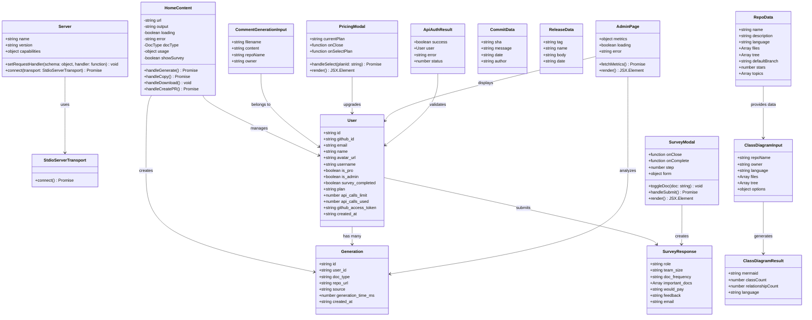

# Class Diagram

This diagram shows the class structure and relationships in the codebase.

```mermaid
classDiagram
    class Server {
        +string name
        +string version
        +object capabilities
        +setRequestHandler(schema: object, handler: function) void
        +connect(transport: StdioServerTransport) Promise
    }
    
    class StdioServerTransport {
        +connect() Promise
    }
    
    class HomeContent {
        -string url
        -string output
        -boolean loading
        -string error
        -DocType docType
        -object usage
        -boolean showSurvey
        +handleGenerate() Promise
        +handleCopy() Promise
        +handleDownload() void
        +handleCreatePR() Promise
    }
    
    class ApiAuthResult {
        +boolean success
        +User user
        +string error
        +number status
    }
    
    class User {
        +string id
        +string github_id
        +string email
        +string name
        +string avatar_url
        +string username
        +boolean is_pro
        +boolean is_admin
        +boolean survey_completed
        +string plan
        +number api_calls_limit
        +number api_calls_used
        +string github_access_token
        +string created_at
    }
    
    class Generation {
        +string id
        +string user_id
        +string doc_type
        +string repo_url
        +string source
        +number generation_time_ms
        +string created_at
    }
    
    class RepoData {
        +string name
        +string description
        +string language
        +Array files
        +Array tree
        +string defaultBranch
        +number stars
        +Array topics
    }
    
    class ClassDiagramInput {
        +string repoName
        +string owner
        +string language
        +Array files
        +Array tree
        +object options
    }
    
    class ClassDiagramResult {
        +string mermaid
        +number classCount
        +number relationshipCount
        +string language
    }
    
    class CommentGenerationInput {
        +string filename
        +string content
        +string repoName
        +string owner
    }
    
    class CommitData {
        +string sha
        +string message
        +string date
        +string author
    }
    
    class ReleaseData {
        +string tag
        +string name
        +string body
        +string date
    }
    
    class SurveyResponse {
        +string role
        +string team_size
        +string doc_frequency
        +Array important_docs
        +string would_pay
        +string feedback
        +string email
    }
    
    class PricingModal {
        +string currentPlan
        +function onClose
        +function onSelectPlan
        +handleSelect(planId: string) Promise
        +render() JSX.Element
    }
    
    class SurveyModal {
        +function onClose
        +function onComplete
        +number step
        +object form
        +toggleDoc(doc: string) void
        +handleSubmit() Promise
        +render() JSX.Element
    }
    
    class AdminPage {
        +object metrics
        +boolean loading
        +string error
        +fetchMetrics() Promise
        +render() JSX.Element
    }
    
    Server --> StdioServerTransport : uses
    HomeContent --> User : manages
    HomeContent --> Generation : creates
    User --> Generation : has many
    ClassDiagramInput --> ClassDiagramResult : generates
    CommentGenerationInput --> User : belongs to
    RepoData --> ClassDiagramInput : provides data
    User --> SurveyResponse : submits
    PricingModal --> User : upgrades
    SurveyModal --> SurveyResponse : creates
    AdminPage --> User : displays
    AdminPage --> Generation : analyzes
    ApiAuthResult --> User : validates
```

---

*Generated by [SourceDocs.ai](https://www.sourcedocs.ai)*
